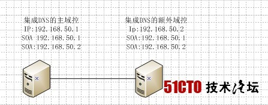

+++
title = "DNS"
date = 2020-09-05

[taxonomies]
categories = ["安全"]
+++

# DNS中的七大资源记录介绍

在Microsoft产品系列中，ADDS是一个很出色的设计平台，说到AD，那么我们就不得不提起他的合作伙伴--DNS，相信大家都知道，DNS在AD中的重要地位，就如男人和女人一样，要想有所作为，他们2个就必须进行结合，缺少任何一方，这个社会也就失去了色彩！) DNS分为正向查找区域和反向查找区域，然后在分为，主要，辅助，存根区域，在这些区域里，又存在着很多的记录，今天，就让我们来看看这些记录：
<!-- more -->

1，A记录
A记录也称为主机记录，是使用最广泛的DNS记录，A记录的基本作用就是说明一个域名对应的IP是多少， 它是域名和IP地址的对应关系，表现形式为 www.contoso.com 192.168.1.1 这就是一个A记录！A记录除了进行域名IP对应以外，还有一个高级用法，可以作为低成本的负载均衡的解决方案，比如说，www.contoso.com 可以创建多个A记录，对应多台物理服务器的IP地址，可以实现基本的流量均衡！)

2，NS记录
NS记录和SOA记录是任何一个DNS区域都不可或缺的两条记录，NS记录也叫名称服务器记录，用于说明这个区域有哪些DNS服务器负责解析，SOA记录说明负责解析的DNS服务器中哪一个是主服务器。因此，任何一个DNS区域都不可能缺少这两条记录。NS记录，说明了在这个区域里，有多少个服务器来承担解析的任务

3，SOA记录
NS记录说明了有多台服务器在进行解析，但哪一个才是主服务器呢，NS并没有说明，这个就要看SOA记录了，SOA名叫起始授权机构记录，SOA记录说明了在众多NS记录里那一台才是主要的服务器！

4，MX记录
全称是邮件交换记录，在使用邮件服务器的时候，MX记录是无可或缺的，比如A用户向B用户发送一封邮件，那么他需要向ＤＮＳ查询Ｂ的MX记录，DNS在定位到了B的MX记录后反馈给A用户，然后Ａ用户把邮件投递到B用户的ＭＸ记录服务器里！

５，Cname记录
又叫别名记录，我们可以这么理解，我们小的时候都会有一个小名，长大了都是学名，那么正规来说学名的符合公安系统的，那个小名只是我们的一个代名词而已，这也存在一个好处，就是比暴漏自己，比如一个网站a.com 在发布的时候，他可以建立一个别名记录，把B.com发不出去，这样不容易被外在用户所察觉！达到隐藏自己的目的！

6，SRV记录
SRV记录是服务器资源记录的缩写，SRV记录是DNS记录中的新鲜面孔，在RFC2052中才对SRV记录进行了定义，因此很多老版本的DNS服务器并不支持SRV记录。那么SRV记录有什么用呢？SRV记录的作用是说明一个服务器能够提供什么样的服务！SRV记录在微软的Active Directory中有着重要地位，大家知道在NT4时代域和DNS并没有太多关系。但从Win2000开始，域就离不开DNS的帮助了，为什么呢？因为域内的计算机要依赖DNS的SRV记录来定位域控制器！表现形式为：—ldap._tcp.contoso.com 600 IN SRV 0 100 389 NS.contoso.com
ladp: 是一个服务，该标识说明把这台服务器当做响应LDAP请求的服务器
tcp：本服务使用的协议，可以是tcp，也可以是用户数据包协议《udp》
contoso.com：此记录所值的域名
600： 此记录默认生存时间（秒）
IN： 标准DNS Internet类
SRV：将这条记录标识为SRV记录
0： 优先级，如果相同的服务有多条SRV记录，用户会尝试先连接优先级最低的记录
100：负载平衡机制，多条SRV并且优先级也相同，那么用户会先尝试连接权重高的记录
389：此服务使用的端口
NS.contoso.com:提供此服务的主机

7,PTR记录
PTR记录也被称为指针记录，PTR记录是A记录的逆向记录，作用是把IP地址解析为域名。由于我们在前面提到过，DNS的反向区域负责从IP到域名的解析，因此如果要创建PTR记录，必须在反向区域中创建。
以上只是一些简单的介绍，并特别说明了SRV记录的格式，如果掌握了这些为以后的AD管理会有很大的帮助！

\--------------------------------------------------------------------------------------------

强调：SOA记录和NS记录的通俗解释

DNS服务器里有两个比较重要的记录。一个叫SOA记录（起始授权机构） 一个叫NS（Name Server）记录（域名服务器）关于这两个记录，很多文章都有解释，但是很多人还是很糊涂。我现在通俗的解释一下这两个记录是干什么的。如果理解有错误，欢迎高手来指正。

SOA记录表明了DNS服务器之间的关系。SOA记录表明了谁是这个区域的所有者。比如51CTO.COM这个区域。一个DNS服务器安装后，需要创建一个区域，以后这个区域的查询解析，都是通过DNS服务器来完成的。现在来说一下所有者，我这里所说的所有者，就是谁对这个区域有修改权利。常见的DNS服务器只能创建一个标准区域，然后可以创建很多个辅助区域。标准区域是可以读写修改的。而辅助区域只能通过标准区域复制来完成，不能在辅助区域中进行修改。而创建标准区域的DNS就会有SOA记录，或者准确说SOA记录中的主机地址一定是这个标准区域的服务器IP地址。

如果是两台集成了DNS的DC，实际上由于要求DNS区域可写，所以打破了单纯DNS服务器只能有一个标准区域的限制。所以两台DC都有SOA记录指向自己。

NS记录实际上也是在DNS服务器之间，表明谁对某个区域有解释权，即权威DNS。大家都知道电信和网通都有很多的DNS服务器。这些服务器为我们上公网做域名解析提供了很多方便。但是这些DNS服务器有一个有意思的地方是这些DNS不存放任何区域，看上去更像是一个DNS CLIENT，它们被称为唯缓存DNS服务器。它们会缓存大量的解析地址，这样就会让你解析的时候选择它们会觉得很快。它们在查询的时候就会查询NS记录，通过这个记录就知道谁在负责比如51CTO.COM这个地域的管理工作。

还有一种情况来说明NS记录的作用。比如你先在万网申请了一个域名ABC.COM。一般情况是万网的域名服务器替你来解析如WWW.ABC.COM这样的主机记录。如果你想自己架设一个DNS服务器，让这台服务器从今往后替代万网的DNS服务器解析，那么你就需要在你的DNS上设置NS记录，然后将万网域名管理系统中的NS记录改成你的DNSIP。这样以后就是你自己的DNS服务器负责提供解析了。即使万网的DNS服务器出现故障，别人仍然可以找到你。

另外值得一说的是，相对你DNS的CLIENT，你设置的DNS服务器地址就是你的权威DNS。通过NSLOOKUP工具可以看到。而那个非权威应答，恰恰是那个区域真正的NS。

# 域名解析流程

### 0x01 解析类型

**1.** ***\*A记录\****：域名->IP
1.1 泛解析：*.lsawebtest.top都能指向同一个IP
***\*2. cname(别名)记录\****：多个名字映射到同一台计算机，如www和mail这两个别名都指向lsawebtest.top，分别提供www和mail服务。
***\*3. NS记录\****：指定由哪个DNS服务器解析你的域名，如lsawebtest.top/ns2.lsawebtest.top
***\*4. MX记录\****：将以该域名为结尾的电子邮件指向对应的邮件服务器以进行处理，如@lsawebtest.top结尾的邮件发到MX记录的邮件服务器上，权重小的优先。
***\*5. TXT记录\****：域名的说明，可用于SPF(它向收信者表明，哪些邮件服务器是经过某个域名认可会发送邮件)和域名所有权验证。
**6.** ***\*AAAA记录\****：指向IPv6。

### 0x02 域名解析流程

//图片来源于网络
1.先查找hosts文件的映射，找到就直接完成域名解析，否则到第二步。
2.查找本地DNS解析器缓存，有映射就完成解析，命令：ipconfig /displaydns，ipconfig /flushdns，否则进行第三步。
3.找首选（本地）dns服务器，如果要查询的域名包含在本地配置区域资源中，则返回解析结果给客户机，完成域名解析（权威）。如果要查询的域名不由本地DNS服务器区域解析，但该服务器已缓存了此网址映射关系，则调用这个IP地址映射，完成域名解析（非权威）。否则进入第四步。
4.如果设置了dns转发，则此DNS服务器就会把请求转发至上一级DNS服务器，由上一级服务器进行解析，上一级服务器如果不能解析，或找根DNS或把转请求转至上上级，如此循环。如果非转发模式，则首选（本地）dns就把请求发到根dns服务器进行迭代查询直至返回IP到客户机。
以解析www.lsawebtest.top为例：
1.查hosts文件映射，无，下一步。
2.查dns解析器缓存，无，下一步。
3.查首选（本地）dns服务器，无，下一步。
4.首选（本地）dns服务器请求根dns，如图

5.本地（首先）dns服务器向其中一台根dns（root-servers.net）发起请求查询www.lsawebtest.top，如图

返回顶级域top.的ns记录，让你去这几台服务器查询。
6.接着再向其中一台top.域的服务器（c.zdnscloud.com）请求www.lsawebtest.top，返回了lsawebtest.top域的服务器，让你去这其中一台查询，如图

7.接着再向hichina.com查询www.lsawebtest.top，返回一条别名记录，如图

8.当dns请求到别名的时候会终止查询，再对别名发起查询，最终可以获取到一条A记录，就是lsawebtest.top的IP。

### 0x03 结语

这里说明一下，全球dns根服务器只有13台是不准确的说法，还有很多是镜像站，有兴趣的可以查一下为什么只能有13台根dns服务器和百度的dns解析过程，稍微复杂一点点。

